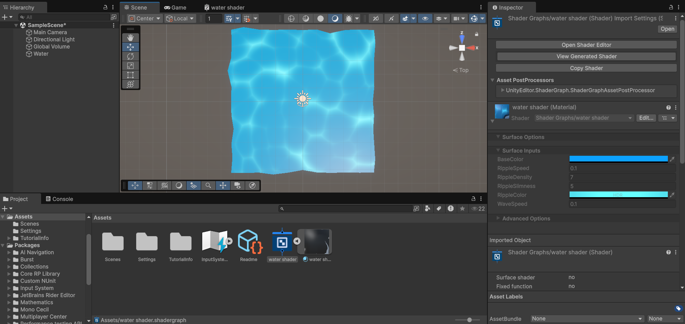

# Динамическая симуляция волн на воде в Unity



## 📖 Описание проекта
Проект реализует динамическую симуляцию волн на водной поверхности в Unity с использованием шейдеров и физики. Основные возможности:
- Генерация волн при взаимодействии объектов с водой.
- Настройка параметров: скорость, амплитуда, плотность волн.
- Визуализация отражений света и деформации поверхности.

## 🛠 Технологии
- **Shader Graph** для создания шейдеров.
- **Уравнения Герстнера** для моделирования волн.
- **Unity URP** (Universal Render Pipeline).
- Интерактивные параметры в инспекторе.

## ⚙️ Установка
1. Клонируйте репозиторий:
   ```bash
   git clone https://github.com/ваш-username/название-репозитория.git
   ```
2. Откройте проект в **Unity 2021.3+**.
3. Убедитесь, что установлены пакеты **Universal RP** и **Shader Graph**.

## 🎮 Использование
- На сцене находится объект `Water` (Plane) с материалом `water shader`.
- Настройте параметры в инспекторе:
  - **RippleSpeed** — скорость ряби.
  - **RippleDensity** — плотность волн.
  - **WaveSpeed** — общая скорость анимации.
- Добавляйте объекты на сцену — их движение создает волны.

## 📁 Структура проекта
- `Assets/Shader Graphs/water shader` — шейдер воды.
- `Assets/Materials` — материалы.
- `Assets/Scenes/Main.unity` — демо-сцена.

## 📸 Скриншоты
- `screenshots/screenshot1.png` — пример волн.
- `screenshots/screenshot2.png` — настройки шейдера.

## 🔗 Ссылки
- [Репозиторий проекта](https://github.com/ваш-username/название-репозитория)
- [Документация Shader Graph](https://docs.unity3d.com/Packages/com.unity.shadergraph@latest)

---

Разработано [Ваше Имя] | [ITMO University](https://itmo.ru)  
2023 г.
```

### Как использовать:
1. Скопируйте весь текст выше.
2. Вставьте в файл `README.md` вашего репозитория.
3. Замените:
   - `ваш-username` и `название-репозитория` на свои данные.
   - Добавьте реальные пути к скриншотам вместо `2.png`, `screenshot1.png`.
   - Укажите свое имя в разделе **Разработано**.
